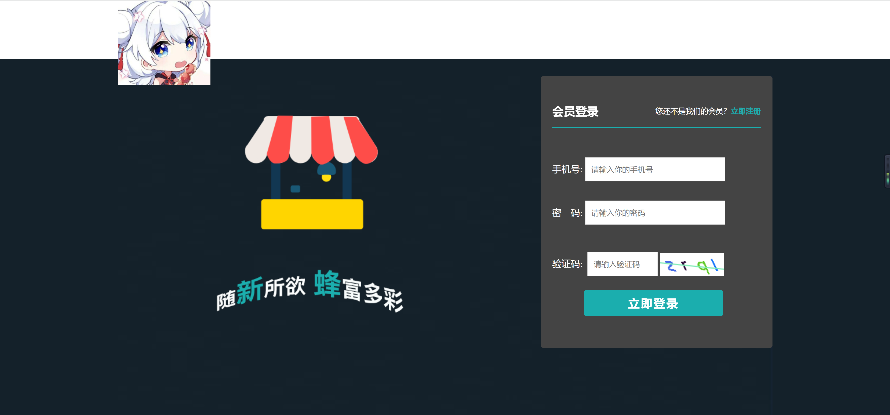

<h1 align="center">服装销售管理系统</h1>

## 简介
服装销售管理系统：角色分为管理员、用户；功能包括商品管理、订单处理、客户管理和报表分析，支持首页配置、个人信息管理和商品推荐，优化销售效率和管理水平。    --计算机毕业设计源码；毕设源码；java毕业设计源码

## 联系方式

<h3 align="center">获取完整代码与数据库文件 + 微信：bysj5151 QQ: 86050149 QQ群: 783742310</h3>

<h3 align="center">可帮忙远程部署 包运行成功！提供远程部署、修改代码、设计文档指导、代码讲解等服务！</h3>

## 功能介绍（完整见运行截图）
管理员：管理员可以通过服装销售管理系统后台进行网站首页配置，包含轮播图、热销商品和新品上线的管理，以及为你推荐的商品配置。此外，管理员负责商品管理，通过商品列表查看、添加和编辑商品，实现库存更新和上下架操作。系统还提供订单管理和客户管理功能，便于管理员处理用户订单、维护客户信息，并进行销售数据分析以制定营销策略。管理员可以修改密码和安全退出，确保系统安全。

用户：用户可以登录服装销售管理系统，访问个人中心进行个人信息管理和订单查看，包括修改昵称、手机号、密码、个性签名和收货信息。用户在“我的订单”中可以查看历史订单和其状态，如已支付或已发货的订单详情。用户还能通过“为你推荐”页面浏览商品，查看商品图片、名称及价格，并通过购物车进行商品购买。系统设计简洁，提升用户的整体购物体验。

## 运行截图

本代码来源于网络,仅供学习参考使用!

